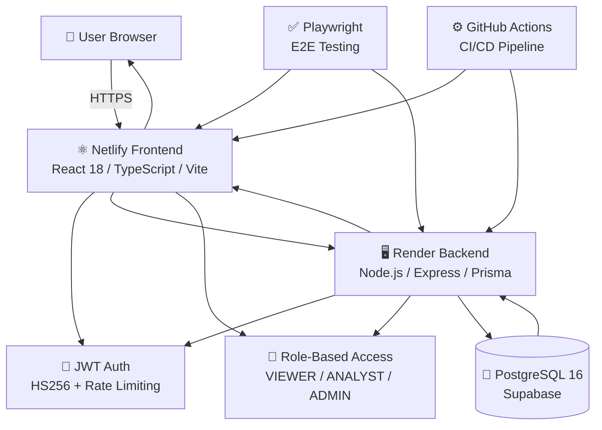

# 💰 Finance Dashboard System

> A financial management platform to track income, expenses, and analyze spending patterns with role-based access control, supported by secure and structured APIs for managing financial data and insights.

 <p align="center">
  <a href="https://finance-dashboard-pro.netlify.app"></a>
  <a href="https://finance-dashboard-api-hqjk.onrender.com/health"></a>
</p>

<p align="center">
  
</p>

---

## 🏛️ Architecture 



---


## 📋 Table of Contents

1. [Screenshot Gallery](#-screenshot-gallery)
2. [System Architecture](#-system-architecture)
3. [Project Journey](#-project-journey)
4. [Technology Stack](#-technology-stack)
5. [Authentication System](#-authentication--authorization)
6. [Database Design](#-database-design)
7. [API Specification](#-api-specification)
8. [Frontend Features](#-frontend-features)
9. [Testing Suite](#-testing-suite)
10. [Deployment](#-deployment)
11. [Quick Start](#-quick-start)
12. [Project Structure](#-project-structure)

---

## 📸 Screenshot Gallery

### 1. **Login Page** — Demo Account & User Authentication
Hybrid authentication system supporting both demo access and registered accounts with real-time validation and secure JWT token generation.


### 2. **Dashboard** — Financial Analytics & Insights
Comprehensive dashboard displaying financial summaries, income vs. expense trends, category breakdown charts, top transactions, and AI-powered spending insights.


### 3. **Records Management** — Transaction History & Filtering
Complete financial records view with advanced filtering, sorting, category organization, and soft-delete support for data integrity.


### 4. **Access Control Demo** — Role-Based Authorization
Shows the unauthorized page (403 Forbidden) when a Viewer attempts to access admin-only features, demonstrating RBAC enforcement in action.


### 5. **User Management** — Admin Controls & User Administration
Admin-only interface for managing user accounts, roles, permissions, and user lifecycle with audit trails.


---
## 💻 Technology Stack

### Backend Stack

| Layer | Technology | Purpose |
|-------|-----------|---------|
| **Runtime** | Node.js 18+ | JavaScript runtime |
| **Language** | TypeScript | Type-safe backend code |
| **Framework** | Express.js | Lightweight HTTP server |
| **Database** | PostgreSQL | Relational data storage |
| **Authentication** | JWT (HS256) | Stateless auth tokens |
| **Deployment** | Render | Node.js hosting platform |

### Frontend Stack

| Layer | Technology | Purpose |
|-------|-----------|---------|
| **Styling** | Tailwind CSS | Utility-first CSS framework |
| **HTTP Client** | Fetch API | REST API calls |
| **Deployment** | Netlify | Static hosting with auto-deploy |

### Cloud Infrastructure

| Service | Provider | Purpose |
|---------|----------|---------|
| **Frontend Hosting** | Netlify | Static SPA hosting + CI/CD |
| **Backend Hosting** | Render | Node.js API server |
| **Database** | Supabase | Managed PostgreSQL + backups |


---

## 🚀 Getting Started

### Quick Links
- **Live Demo**: [https://finance-dashboard-pro.netlify.app](https://finance-dashboard-pro.netlify.app)
- **API Server**: [https://finance-dashboard-api-hqjk.onrender.com](https://finance-dashboard-api-hqjk.onrender.com)
- **GitHub Repo**: [https://github.com/ByteForge24/Finance-Dashboard-System](https://github.com/ByteForge24/Finance-Dashboard-System)

### Demo Accounts (No Signup Required)

| Role | Email | Password |
|------|-------|----------|
| **Viewer** | `viewer@finance-dashboard.local` | `ViewerPassword123` |
| **Analyst** | `analyst@finance-dashboard.local` | `AnalystPassword123` |
| **Admin** | `admin@finance-dashboard.local` | `AdminPassword123` |

### Local Development

```bash
# Clone repository
git clone https://github.com/ByteForge24/Finance-Dashboard-System.git
cd Finance-Dashboard-System

# Backend setup
cd backend
npm run setup
npm run dev  # Runs on http://localhost:3000

# Frontend setup (in new terminal)
cd ../frontend
npm install
npm run dev  # Runs on http://localhost:5173

# Run E2E Tests
cd ../tests
npm install
npx playwright install --with-deps
npx playwright test --headed

```

---

## ✨ Core Features

### Authentication & Security
- Hybrid Authentication (Demo access, user signup, secure login)
- JWT Token-Based Auth (HS256 encryption, 24-hour expiration)
- Rate Limiting (5 login attempts per 15 minutes, 10 signups per hour)
- Password Security (bcrypt hashing)
- Session Management (localStorage-based token persistence)
- No Username Enumeration (generic error messages)

### Role-Based Access Control
- VIEWER Role (Dashboard-only access, read-only)
- ANALYST Role (Dashboard + read-only financial records)
- ADMIN Role (Full system access with create, edit, delete)
- Permission Enforcement (RBAC checks on all endpoints)
- Role Management (Dynamic role assignment)

### Financial Record Management
- Create Records (Add income & expense transactions)
- View Records (Paginated list with filters)
- Edit Records (Update transaction details)
- Soft Delete (Logical deletion with data retention)
- Categories (Organize transactions)
- Date Tracking (Validation for transaction dates)

### Dashboard Analytics
- Financial Summary (Total income, expenses, balance)
- Spending Trends (30-day patterns)
- Category Breakdown (Expense distribution)
- Recent Activity (Latest transactions)
- Real-Time Updates (Live data refresh)

### User Interface & UX
- Responsive Design (Mobile, tablet, desktop)
- Dark Mode (Light/dark theme toggle)
- Fast Performance (Vite-optimized)
- Intuitive Navigation (Hash-based routing)
- Form Validation (Real-time error messages)
- Toast Notifications (Feedback messages)

### Testing & Quality
- 58 E2E Tests (Comprehensive test suite)
- 72% Code Coverage (All critical paths)
- Cross-Browser Testing (Chromium, Firefox, WebKit)
- Mobile Testing (Responsive validation)
- Security Tests (CORS, RBAC, auth)
- Production Validation (Live URL testing)

### Deployment & DevOps
- Frontend Hosting (Netlify with auto-deploy)
- Backend Hosting (Render with auto-deploy)
- Database (Supabase PostgreSQL)
- CI/CD Pipeline (GitHub Actions)
- HTTPS/SSL (Encrypted connections)
- Health Checks (API monitoring)

### API Features
- RESTful API (20+ endpoints)
- API Versioning (/api/v1/*)
- Bearer Token Auth (JWT in header)
- Input Validation (Type-safe)
- OpenAPI Documentation
- Error Handling (Consistent responses)

### Database
- PostgreSQL (ACID compliance)
- Prisma ORM (Type-safe queries)
- UUID Primary Keys
- Performance Indexes
- Soft Delete (Logical deletion)
- Data Integrity (Constraints)

### Developer Experience
- TypeScript (Full type safety)
- Modular Architecture (Domain-driven)
- Easy Setup (npm run setup)
- Documentation (README files)
- Local Development (Hot reload)
- Error Tracking (Detailed logging)

---

## 🗄️ Database Design

### Core Tables

#### Users Table
```sql
CREATE TABLE users (
  id UUID PRIMARY KEY,
  email VARCHAR(255) UNIQUE NOT NULL,
  password VARCHAR(255) NOT NULL,
  role ENUM('VIEWER', 'ANALYST', 'ADMIN') NOT NULL,
  status ENUM('ACTIVE', 'INACTIVE') NOT NULL,
  createdAt TIMESTAMP DEFAULT NOW(),
  updatedAt TIMESTAMP DEFAULT NOW()
);

CREATE UNIQUE INDEX users_email_idx ON users(email);
CREATE INDEX users_role_idx ON users(role);
```

#### Financial Records Table
```sql
CREATE TABLE records (
  id UUID PRIMARY KEY,
  amount DECIMAL(12,2) NOT NULL,
  type ENUM('INCOME', 'EXPENSE') NOT NULL,
  category VARCHAR(100) NOT NULL,
  date DATE NOT NULL,
  notes TEXT,
  deletedAt TIMESTAMP NULL,
  createdAt TIMESTAMP DEFAULT NOW(),
  updatedAt TIMESTAMP DEFAULT NOW()
);

CREATE INDEX records_date_idx ON records(date);
CREATE INDEX records_category_idx ON records(category);
CREATE INDEX records_deletedAt_idx ON records(deletedAt);
```

### Soft Delete Pattern

Financial records support **soft delete** (logical deletion):

```
When user deletes a record:
- Record marked with deletedAt timestamp
- Record excluded from GET, PATCH, DELETE operations
- Record excluded from dashboard calculations
- Record still in database (data integrity maintained)
```

---

## 🔌 API Specification

### Core Endpoints (Sampled)

#### Authentication
- `POST /api/v1/auth/login` - User login
- `POST /api/v1/auth/signup` - Create new account
- `GET /api/v1/auth/me` - Get current user

#### Dashboard
- `GET /api/v1/dashboard/summary` - Financial summary
- `GET /api/v1/dashboard/trending` - Trending categories
- `GET /api/v1/dashboard/category-breakdown` - Expense by category
- `GET /api/v1/dashboard/insights` - AI insights

#### Records
- `GET /api/v1/records` - List records (paginated)
- `POST /api/v1/records` - Create record (admin)
- `PATCH /api/v1/records/:id` - Update record (admin)
- `DELETE /api/v1/records/:id` - Delete record (soft delete, admin)

#### Users
- `GET /api/v1/users` - List users (admin)
- `GET /api/v1/users/:id` - Get user (admin)
- `PATCH /api/v1/users/:id/role` - Change role (admin)
- `PATCH /api/v1/users/:id/status` - Change status (admin)

#### Health
- `GET /health` - API status check

Full API documentation in `backend/docs/openapi.yaml`

---

## 📁 Project Structure

```
finance-dashboard-system/
│
├── backend/ # Node.js/Express API Server
│ ├── src/
│ │ ├── app.ts # Express app configuration
│ │ ├── server.ts # Server entry point
│ │ │
│ │ ├── config/
│ │ │ ├── auth-config.ts # JWT configuration
│ │ │ └── prisma.ts # Database client singleton
│ │ │
│ │ ├── modules/ # Feature modules (by domain)
│ │ │ ├── auth/ # Authentication module
│ │ │ │ ├── auth.types.ts
│ │ │ │ ├── auth.service.ts
│ │ │ │ ├── auth.routes.ts
│ │ │ │ └── auth.mapper.ts
│ │ │ │
│ │ │ ├── users/ # User management module
│ │ │ │ ├── users.types.ts
│ │ │ │ ├── users.service.ts
│ │ │ │ └── users.routes.ts
│ │ │ │
│ │ │ ├── records/ # Financial records module
│ │ │ │ ├── records.types.ts
│ │ │ │ ├── records.service.ts
│ │ │ │ └── records.routes.ts
│ │ │ │
│ │ │ └── dashboard/ # Dashboard analytics module
│ │ │ ├── dashboard.types.ts
│ │ │ ├── dashboard.service.ts
│ │ │ └── dashboard.routes.ts
│ │ │
│ │ ├── routes/ # Route aggregation
│ │ │ ├── api.ts # /api routes
│ │ │ ├── v1.ts # /api/v1 routes
│ │ │ └── health.ts # /health endpoint
│ │ │
│ │ └── shared/ # Shared utilities & middleware
│ │ ├── access-control/ # RBAC implementation
│ │ ├── domain/ # Domain models
│ │ ├── errors/ # Error classes & handler
│ │ ├── middleware/ # Express middleware
│ │ ├── utils/ # Utility functions
│ │ └── validation/ # Input validators
│ │
│ ├── prisma/
│ │ ├── schema.prisma # Database schema definition
│ │ └── seed.ts # Database seeding script
│ │
│ ├── tests/ # Unit & integration tests
│ │ ├── integration/ # Integration tests
│ │ └── unit/ # Unit tests
│ │
│ ├── package.json
│ ├── tsconfig.json
│ ├── jest.config.js
│ └── README.md
│
├── frontend/ # React SPA (Vanilla JS with Vite)
│ ├── src/
│ │ ├── api.js # API client & http utilities
│ │ ├── app.js # Main application logic
│ │ ├── auth.js # Authentication & token management
│ │ │
│ │ ├── layout.js # Layout & navigation component
│ │ │
│ │ ├── page-login.js # Login page (Sign In / Sign Up)
│ │ ├── page-dashboard.js # Dashboard page (Analytics)
│ │ ├── page-records.js # Records page (Transactions)
│ │ ├── page-users.js # Users page (Admin only)
│ │ ├── page-settings.js # Settings page (Preferences)
│ │ ├── page-unauthorized.js # 403 error page
│ │ │
│ │ ├── toast.js # Toast notifications utility
│ │ │
│ │ └── index.css # Global styles (Tailwind CSS)
│ │
│ ├── index.html # HTML template
│ ├── vite.config.js # Vite configuration
│ ├── tailwind.config.js # Tailwind CSS config
│ ├── package.json
│ └── README.md
│
├── tests/ # Playwright E2E Tests
│ ├── e2e/ # End-to-end test specs
│ │ ├── frontend-signin.spec.ts # 11 authentication tests
│ │ ├── frontend-dashboard-detailed.spec.ts
│ │ ├── frontend-records-detailed.spec.ts
│ │ ├── frontend-ux-and-mobile.spec.ts
│ │ ├── api-security-and-integrity.spec.ts
│ │ ├── production-writes.optional.spec.ts
│ │ ├── backend-user-management.optional.spec.ts
│ │ └── backend-record-lifecycle.optional.spec.ts
│ │
│ ├── support/ # Test utilities
│ │ ├── app.ts # Page object & helpers
│ │ ├── api.ts # API testing utilities
│ │ └── env.ts # Environment config
│ │
│ ├── playwright.config.ts # Playwright configuration
│ ├── package.json
│ └── README.md
│
└── README.md # Project documentation
```

---


**Built with **❤️** using TypeScript, React, Express, PostgreSQL, and Playwright**

**Last Updated**: April 9, 2026 | **Version**: 1.0.0 | **Status**: Production Ready ✅
