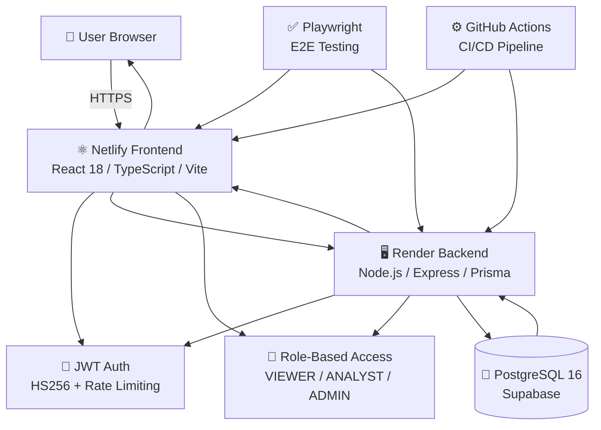

# 💰 Finance Dashboard System

> A financial management platform to track income, expenses, and analyze spending patterns with role-based access control, supported by secure and structured APIs for managing financial data and insights.

 <p align="center">
  <a href="https://finance-dashboard-pro.netlify.app"></a>
  <a href="https://finance-dashboard-api-hqjk.onrender.com/health"></a>
</p>

<p align="center">
  
</p>

---

## 🏛️ Architecture 



---


## 📋 Table of Contents

1. [System Architecture](#-system-architecture)
2. [Project Journey](#-project-journey)
3. [Technology Stack](#-technology-stack)
4. [Authentication System](#-authentication--authorization)
5. [Database Design](#-database-design)
6. [API Specification](#-api-specification)
7. [Frontend Features](#-frontend-features)
8. [Testing Suite](#-testing-suite)
9. [Deployment](#-deployment)
10. [Quick Start](#-quick-start)
11. [Project Structure](#-project-structure)

---
## 💻 Technology Stack

### Backend Stack

| Layer | Technology | Purpose |
|-------|-----------|---------|
| **Runtime** | Node.js 18+ | JavaScript runtime |
| **Language** | TypeScript | Type-safe backend code |
| **Framework** | Express.js | Lightweight HTTP server |
| **Database** | PostgreSQL | Relational data storage |
| **ORM** | Prisma | Type-safe database access |
| **Authentication** | JWT (HS256) | Stateless auth tokens |
| **Validation** | Custom Layer | Runtime type validation |
| **Testing** | Jest + Supertest | Unit & integration tests |
| **Deployment** | Render | Node.js hosting platform |

### Frontend Stack

| Layer | Technology | Purpose |
|-------|-----------|---------|
| **Runtime** | Modern Browser | Chrome, Firefox, Safari |
| **Build Tool** | Vite | Fast development & production builds |
| **Framework** | React 18 | UI component library |
| **Styling** | Tailwind CSS | Utility-first CSS framework |
| **Routing** | Custom Hash Router | SPA routing for static hosting |
| **State** | React Context | Client-side state management |
| **HTTP Client** | Fetch API | REST API calls |
| **Deployment** | Netlify | Static hosting with auto-deploy |

### Testing Stack

| Layer | Technology | Purpose |
|-------|-----------|---------|
| **Test Runner** | Playwright | End-to-end browser automation |
| **Browsers** | Chromium, Firefox, WebKit | Cross-browser testing |
| **Deployment Testing** | Production URLs | Real environment validation |
| **Coverage** | 58+ Tests | Auth, RBAC, Features, API, Mobile |

### Cloud Infrastructure

| Service | Provider | Purpose |
|---------|----------|---------|
| **Frontend Hosting** | Netlify | Static SPA hosting + CI/CD |
| **Backend Hosting** | Render | Node.js API server |
| **Database** | Supabase | Managed PostgreSQL + backups |


---

## 🚀 Getting Started

### Quick Links
- **Live Demo**: [https://finance-dashboard-pro.netlify.app](https://finance-dashboard-pro.netlify.app)
- **API Server**: [https://finance-dashboard-api-hqjk.onrender.com](https://finance-dashboard-api-hqjk.onrender.com)
- **GitHub Repo**: [https://github.com/ByteForge24/Finance-Dashboard-System](https://github.com/ByteForge24/Finance-Dashboard-System)

### Demo Accounts (No Signup Required)

| Role | Email | Password |
|------|-------|----------|
| **Viewer** | `viewer@finance-dashboard.local` | `ViewerPassword123` |
| **Analyst** | `analyst@finance-dashboard.local` | `AnalystPassword123` |
| **Admin** | `admin@finance-dashboard.local` | `AdminPassword123` |

### Local Development

```bash
# Clone repository
git clone https://github.com/ByteForge24/Finance-Dashboard-System.git
cd Finance-Dashboard-System

# Backend setup
cd backend
npm run setup
npm run dev  # Runs on http://localhost:3000

# Frontend setup (in new terminal)
cd ../frontend
npm install
npm run dev  # Runs on http://localhost:5173

# Run E2E Tests
cd ../tests
npm install
npx playwright install --with-deps
npx playwright test --headed

```

---

## 🔐 Authentication & Authorization

### Hybrid Authentication System

The system implements a sophisticated hybrid authentication approach that balances security with user experience:

#### 1. **Demo Access (Fast Track)**

```
EVALUATOR
   │
   ├─▶ Click "Demo - Viewer" Button
   │   └─ Instant Login (pre-filled credentials)
   │      └─ Redirected to Dashboard
   │
   ├─▶ Click "Demo - Analyst" Button
   │   └─ Instant Login
   │      └─ Dashboard + Records Access
   │
   └─▶ Click "Demo - Admin" Button
       └─ Instant Login
          └─ Full System Access
          
BENEFITS:
✓ No signup friction
✓ Immediate access to all features
✓ Safe (pre-registered demo accounts)
✓ Rate-limited (5 logins per 15 minutes)
```

#### 2. **User Signup (New Accounts)**

```
NEW USER
   │
   ├─▶ Click "Sign Up" Tab
   │   │
   │   ├─ Enter email + password
   │   ├─ Submit form
   │   │
   │   ├─ Validation: Email format, password strength
   │   ├─ Check: Email not already registered
   │   │       Email not in reserved demo list
   │   │
   │   └─▶ Create account
   │       ├─ Hash password (bcrypt)
   │       ├─ Assign default VIEWER role
   │       ├─ Create database record
   │       └─ Return auth token (JWT)
   │
   └─▶ Automatically redirected to dashboard
   
RATE LIMITING: 10 signup requests per hour
```

#### 3. **User Login (Existing Accounts)**

```
EXISTING USER
   │
   ├─▶ Click "Sign In" Tab
   │   │
   │   ├─ Enter email + password
   │   ├─ Submit form
   │   │
   │   ├─ Check: Account exists
   │   ├─ Verify: Password matches (bcrypt)
   │   ├─ Check: Account status is ACTIVE
   │   │
   │   ├─ On Success:
   │   │  └─ Generate JWT token (expires in 24 hours)
   │   │     └─ Return token to client
   │   │     └─ Redirect to dashboard
   │   │
   │   └─ On Failure:
   │      └─ Return generic error (no username enumeration)
   │         "Invalid email or password"
   │
   └─▶ Rate Limiting: 5 login attempts per 15 minutes
```

#### 4. **Token Flow**

```
REQUEST FLOW:
┌──────────────────────────────────────────────┐
│  Browser (JWT stored in localStorage)        │
└──────────────────────────────────────────────┘
                      │
                      │ GET /api/v1/dashboard
                      │ Authorization: Bearer eyJhbG...
                      ▼
         ┌──────────────────────────────┐
         │  API Server                  │
         │                              │
         │  1. Extract token from header
         │  2. Verify JWT signature
         │  3. Check token expiration
         │  4. Validate user role
         │  5. Check endpoint permission
         └──────────────────────────────┘
                      │
                      ▼
         ┌──────────────────────────────┐
         │  ✓ Access Granted            │
         │  Return dashboard data       │
         │                              │
         │  OR                          │
         │                              │
         │  ✗ Access Denied             │
         │  Return 401/403 error        │
         └──────────────────────────────┘
```

### JWT Token Structure

```json
{
  "header": {
    "alg": "HS256",
    "typ": "JWT"
  },
  "payload": {
    "sub": "user-id-uuid",
    "email": "user@example.com",
    "role": "ANALYST",
    "iat": 1712659200,
    "exp": 1712745600
  },
  "signature": "HMACSHA256(header.payload, secret)"
}
```

### Permission Matrix

| Endpoint | VIEWER | ANALYST | ADMIN | Description |
|----------|--------|---------|-------|-------------|
| `GET /dashboard/*` | ✓ | ✓ | ✓ | View dashboard (all can see) |
| `GET /records` | ✗ | ✓ | ✓ | List financial records |
| `POST /records` | ✗ | ✗ | ✓ | Create financial record |
| `PATCH /records/:id` | ✗ | ✗ | ✓ | Edit financial record |
| `DELETE /records/:id` | ✗ | ✗ | ✓ | Delete financial record |
| `GET /users` | ✗ | ✗ | ✓ | List users |
| `GET /users/:id` | ✗ | ✗ | ✓ | View user details |
| `PATCH /users/:id/role` | ✗ | ✗ | ✓ | Change user role |
| `PATCH /users/:id/status` | ✗ | ✗ | ✓ | Deactivate/activate user |

---

## 🗄️ Database Design

### Core Tables

#### Users Table
```sql
CREATE TABLE users (
  id UUID PRIMARY KEY,
  email VARCHAR(255) UNIQUE NOT NULL,
  password VARCHAR(255) NOT NULL,
  role ENUM('VIEWER', 'ANALYST', 'ADMIN') NOT NULL,
  status ENUM('ACTIVE', 'INACTIVE') NOT NULL,
  createdAt TIMESTAMP DEFAULT NOW(),
  updatedAt TIMESTAMP DEFAULT NOW()
);

CREATE UNIQUE INDEX users_email_idx ON users(email);
CREATE INDEX users_role_idx ON users(role);
```

#### Financial Records Table
```sql
CREATE TABLE records (
  id UUID PRIMARY KEY,
  amount DECIMAL(12,2) NOT NULL,
  type ENUM('INCOME', 'EXPENSE') NOT NULL,
  category VARCHAR(100) NOT NULL,
  date DATE NOT NULL,
  notes TEXT,
  deletedAt TIMESTAMP NULL,
  createdAt TIMESTAMP DEFAULT NOW(),
  updatedAt TIMESTAMP DEFAULT NOW()
);

CREATE INDEX records_date_idx ON records(date);
CREATE INDEX records_category_idx ON records(category);
CREATE INDEX records_deletedAt_idx ON records(deletedAt);
```

### Soft Delete Pattern

Financial records support **soft delete** (logical deletion):

```
When user deletes a record:
- Record marked with deletedAt timestamp
- Record excluded from GET, PATCH, DELETE operations
- Record excluded from dashboard calculations
- Record still in database (data integrity maintained)
```

---

## 🔌 API Specification

### Core Endpoints (Sampled)

#### Authentication
- `POST /api/v1/auth/login` - User login
- `POST /api/v1/auth/signup` - Create new account
- `GET /api/v1/auth/me` - Get current user

#### Dashboard
- `GET /api/v1/dashboard/summary` - Financial summary
- `GET /api/v1/dashboard/trending` - Trending categories
- `GET /api/v1/dashboard/category-breakdown` - Expense by category
- `GET /api/v1/dashboard/insights` - AI insights

#### Records
- `GET /api/v1/records` - List records (paginated)
- `POST /api/v1/records` - Create record (admin)
- `PATCH /api/v1/records/:id` - Update record (admin)
- `DELETE /api/v1/records/:id` - Delete record (soft delete, admin)

#### Users
- `GET /api/v1/users` - List users (admin)
- `GET /api/v1/users/:id` - Get user (admin)
- `PATCH /api/v1/users/:id/role` - Change role (admin)
- `PATCH /api/v1/users/:id/status` - Change status (admin)

#### Health
- `GET /health` - API status check

Full API documentation in `backend/docs/openapi.yaml`

---

## 📁 Project Structure

```
finance-dashboard-system/
│
├── backend/ # Node.js/Express API Server
│ ├── src/
│ │ ├── app.ts # Express app configuration
│ │ ├── server.ts # Server entry point
│ │ │
│ │ ├── config/
│ │ │ ├── auth-config.ts # JWT configuration
│ │ │ └── prisma.ts # Database client singleton
│ │ │
│ │ ├── modules/ # Feature modules (by domain)
│ │ │ ├── auth/ # Authentication module
│ │ │ │ ├── auth.types.ts
│ │ │ │ ├── auth.service.ts
│ │ │ │ ├── auth.routes.ts
│ │ │ │ └── auth.mapper.ts
│ │ │ │
│ │ │ ├── users/ # User management module
│ │ │ │ ├── users.types.ts
│ │ │ │ ├── users.service.ts
│ │ │ │ └── users.routes.ts
│ │ │ │
│ │ │ ├── records/ # Financial records module
│ │ │ │ ├── records.types.ts
│ │ │ │ ├── records.service.ts
│ │ │ │ └── records.routes.ts
│ │ │ │
│ │ │ └── dashboard/ # Dashboard analytics module
│ │ │ ├── dashboard.types.ts
│ │ │ ├── dashboard.service.ts
│ │ │ └── dashboard.routes.ts
│ │ │
│ │ ├── routes/ # Route aggregation
│ │ │ ├── api.ts # /api routes
│ │ │ ├── v1.ts # /api/v1 routes
│ │ │ └── health.ts # /health endpoint
│ │ │
│ │ └── shared/ # Shared utilities & middleware
│ │ ├── access-control/ # RBAC implementation
│ │ ├── domain/ # Domain models
│ │ ├── errors/ # Error classes & handler
│ │ ├── middleware/ # Express middleware
│ │ ├── utils/ # Utility functions
│ │ └── validation/ # Input validators
│ │
│ ├── prisma/
│ │ ├── schema.prisma # Database schema definition
│ │ └── seed.ts # Database seeding script
│ │
│ ├── tests/ # Unit & integration tests
│ │ ├── integration/ # Integration tests
│ │ └── unit/ # Unit tests
│ │
│ ├── package.json
│ ├── tsconfig.json
│ ├── jest.config.js
│ └── README.md
│
├── frontend/ # React SPA (Vanilla JS with Vite)
│ ├── src/
│ │ ├── api.js # API client & http utilities
│ │ ├── app.js # Main application logic
│ │ ├── auth.js # Authentication & token management
│ │ │
│ │ ├── layout.js # Layout & navigation component
│ │ │
│ │ ├── page-login.js # Login page (Sign In / Sign Up)
│ │ ├── page-dashboard.js # Dashboard page (Analytics)
│ │ ├── page-records.js # Records page (Transactions)
│ │ ├── page-users.js # Users page (Admin only)
│ │ ├── page-settings.js # Settings page (Preferences)
│ │ ├── page-unauthorized.js # 403 error page
│ │ │
│ │ ├── toast.js # Toast notifications utility
│ │ │
│ │ └── index.css # Global styles (Tailwind CSS)
│ │
│ ├── index.html # HTML template
│ ├── vite.config.js # Vite configuration
│ ├── tailwind.config.js # Tailwind CSS config
│ ├── package.json
│ └── README.md
│
├── tests/ # Playwright E2E Tests
│ ├── e2e/ # End-to-end test specs
│ │ ├── frontend-signin.spec.ts # 11 authentication tests
│ │ ├── frontend-dashboard-detailed.spec.ts
│ │ ├── frontend-records-detailed.spec.ts
│ │ ├── frontend-ux-and-mobile.spec.ts
│ │ ├── api-security-and-integrity.spec.ts
│ │ ├── production-writes.optional.spec.ts
│ │ ├── backend-user-management.optional.spec.ts
│ │ └── backend-record-lifecycle.optional.spec.ts
│ │
│ ├── support/ # Test utilities
│ │ ├── app.ts # Page object & helpers
│ │ ├── api.ts # API testing utilities
│ │ └── env.ts # Environment config
│ │
│ ├── playwright.config.ts # Playwright configuration
│ ├── package.json
│ └── README.md
│
└── README.md # Project documentation
```

---


**Built with **❤️** using TypeScript, React, Express, PostgreSQL, and Playwright**

**Last Updated**: April 9, 2026 | **Version**: 1.0.0 | **Status**: Production Ready ✅
